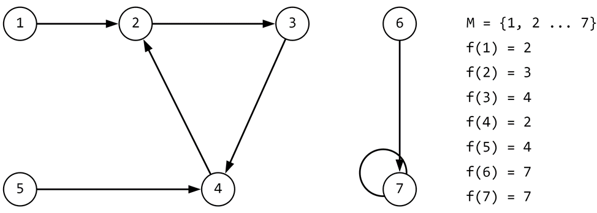
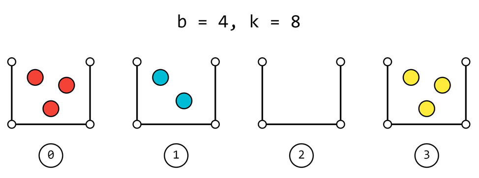

# Составление программы для изучения некоторых свойств унаров на примере функции Капрекара.

### **Часть 1. ВВЕДЕНИЕ**

### **Контекст**:

Унарной функцией на множестве называется тотальная функция, принимающая в качестве аргумента лишь одну переменную и возвращающая значение из этого множества.
Можно привести несколько примеров унарных функций:
•	Тождественная функция на любом непустом множестве: n -> n;
•	n -> n + 1 на любом бесконечном множестве;

Обратим внимание на одно из важных свойств унарных функций на конечном множестве.

***Степенью*** функции называется n-кратная композиция функции f, то есть f 0 (a) = a, f 2 (a) = f(f(a)) и так далее.

**Теорема.** Если функция на конечном множестве тотальна, то последовательность значений степеней этой функции для любого аргумента заключительно периодическая, то есть найдутся такие натуральные m, k, что для любого i > m   f i (a) = f i+k (a).

**Доказательство.** Рассмотрим последовательность значений степеней функции для произвольного аргумента. Она существует, так как функция тотальна. Так как множество конечно, по принципу Дирихле в последовательности найдутся хотя бы два одинаковых элемента. Пусть i < j – такая наименьшая пара натуральных чисел, что f i (a) = f j (a). Тогда положим m = i – 1, k = j – i.

Изобразим унарную функцию на конечном множестве в виде ориентированного графа:

* Множество вершин совпадает с множеством, на котором рассматривается функция;
* Множество ребер определяется следующим образом: ребро (u, v) существует тогда и только тогда, когда f(u) = v;

Например, некоторая функция f: M -> M и ее граф:



Исходя из теоремы, заметим, что граф унарной функции на конечном множестве в общем случае будет выглядеть следующим образом: переходя из любой вершины по стрелкам за конечное количество шагов можно прийти к циклу либо неподвижной точке (частный случай цикла, состоящий из одной точки).

***Глубиной*** графа будем называть максимальное число ребер, переходя по которым, начиная с любой вершины, можно дойти до цикла или неподвижной точки. Например, глубина вышеприведенного графа равна двум.

***Длиной*** цикла будем называть количество вершин, находящихся в данном цикле. Например, длина неподвижной точки равна одному.

Рассмотрим следующую задачу:

«Выберем любое число n длины k, записанное в системе счисления b.

Расположим цифры сначала в порядке убывания, затем, переставив их в обратном порядке, получим новое число.

Вычтем последнее число из числа, в котором цифры расположены в порядке убывания.

Полученная разность – результат функции Капрекара K(n, k, b)».

Таким образом, целью задачи является написание компьютерной программы, помогающей изучить свойства функции Капрекара в зависимости от системы счисления и длины числа: нахождение всех неподвижных точек и циклов и их длин, а также глубины соответствующего графа.

### **Часть 2. ХОД ВЫПОЛНЕНИЯ ЗАДАНИЯ**

### **Подготовительный этап**:

**Наблюдение.**  Результат функции зависит только от набора цифр и не зависит от их перестановки. Например, результат функции у чисел 235 и 325 будет одинаков. Наблюдение следует из определения функции.

Данное наблюдение стоит изучить подробнее и узнать, во сколько раз программа будет работать быстрее при грамотном ее составлении. 

Итак, нам важен только набор цифр – задачу о количестве различных наборов цифр заданной длины в заданной системе счисления можно представить следующим образом: «Сколькими способами можно разложить k неразличимых шаров по b корзинам?» Почему так?

Допустим, перед нами такая картинка:



Каждая из b корзин отвечает за отдельную цифру, а некоторое распределение шаров по этим корзинам дает понятие о том, сколько каких цифр будет в нашем числе. 
Таким образом, картинка выше перечисляет все восьмизначные числа в четверичной системе счисления вида «00011333, 00013133, … 33311000».

Решение такой задачи – число сочетаний с повторениями, формула:

(b+k-1)!/(k!(b-1)!)

Мы узнали, сколько существует чисел с неповторяющимися наборами цифр. А как их перечислить? Ниже представлено одно из возможных решений.

``` python
make_values.py

from conversion import in_10


def solving_the_combinatorial_problem(b, k):  # Вспомогательная функция, решаем задачу с шариками и корзинами
    if k == 0:  # Если шариков не осталось, корзины оставляем пустыми
        return [b * '0']
    elif b == 1:  # Если осталась только одна корзина, складываем туда все оставшиеся шарики
        return [str(k)]
    else:  # В иных случаях используем рекурсию
        solution = []
        for i in range(k + 1):  # Забрали i шариков для первой корзины,
            solution_of_subtask = solving_the_combinatorial_problem(b - 1, k - i)  # рассмотрели подзадачу с меньшим количеством корзин
            for j in range(len(solution_of_subtask)):
                solution.append(str(i) + solution_of_subtask[j])
        return solution


def solving_the_main_problem(b, k):  # Основная функция, через решение задачи с шариками и корзинами восстановим интересующий набор цифр
    solution = []
    solution_of_previous_problem = solving_the_combinatorial_problem(b, k)  # Получили вспомогательный набор
    for i in range(len(solution_of_previous_problem)):
        s = ''
        for j in range(b):
            s += int(solution_of_previous_problem[i][j]) * str(j)  # Восстановили текущее число по набору
        solution.append(in_10(s, b))
    return solution

```

### **Представление кода программы и пример вычисления**


Основная программа состоит из четырех главных файлов:
* Программа make_values.py, осуществляющая составление списка чисел с неповторяющимися наборами цифр;
* Программа kaprekar.py, осуществляющая непосредственно вычисление функции Капрекара в заданной точке;
* Программа search.py, осуществляющая две функции: поиск неподвижных точек и/или циклов и глубины графа функции;
* Программа main.py, осуществляющая ввод данных и вывод результата программы с помощью вышеперечисленных программ и собственных функций.

``` python
kaprekar.py

def Kaprekar(n, k, b):  # Задано число (последовательность цифр) n длины k в системе счисления b
    if (type(n) is int) and (n in range(b ** k)) and \
            (type(k) is int) and (k >= 2) & \
            (type(b) is int) and (b >= 2):
        d = []
        for m in range(k):
            n, q = divmod(n, b)
            d.append(q)

        l_alpha = sorted(d, reverse=True)
        l_omega = sorted(d)

        def N(l):
            c = 0
            for m in range(k):
                c = c * b + l[m]
            return c

        i_alpha = N(l_alpha)
        i_omega = N(l_omega)
        return i_alpha - i_omega
    else:
        return None
```

``` python
search.py

# Search_1 - поиск циклов и неподвижных точек
# Search_2 - поиск глубины дерева
from kaprekar import Kaprekar
from conversion import in_N
from make_values import solving_the_main_problem


def Search_1(nums, l, s):  # Получаем на вход множество из неподвижных точек и циклов, длину, систему счисления
    nums = sorted(nums)  # Отсортировали список
    nums_new = []  # Множество чисел, которые уже обработали
    nwonn = nums  # Множество чисел, которые еще не обработали (Nums WithOut Nums_New)
    a = []  # Множество чисел, участвующих в одном цикле
    k = 0  #
    while len(nwonn) != 0:
        if k == 0:
            a.append(nwonn[k])  # Добавили в a первое число из очереди необработанных чисел
            nums_new.append(nwonn[k])  # Показали, что первое число обработали
        c = Kaprekar(nwonn[k], l, s)  # Результат значения функции Капрекара от последнего элемента в a
        if c in a:  # Если c уже находится в массиве, значит, цикл закончен,
            # выводим его и определяем, цикл это или неподвижная точка
            for i in range(len(a)):
                print(in_N(a[i], s), end=" -> ")
            print(in_N(c, s), end=", ")
            if len(a) == 1:
                print('Неподвижная точка')
            else:
                print('Цикл длины', len(a))
            nwonn = []  # Обновляем очередь, убирая оттуда уже обработанные числа
            for i in range(len(nums)):
                if nums[i] not in nums_new:
                    nwonn.append(nums[i])
            a = []
            k = 0
        else:  # Если новое значение еще не находится в a
            for i in range(len(nwonn)):  # Ищем, под каким индексом он находится в nwonn
                if nwonn[i] == c:
                    k = i
                    break
            a.append(c)  # Добавляем в a это значение
            nums_new.append(c)  # Добавляем в множество обработанных чисел


def Search_2(nums, l, s):
    all_nums = solving_the_main_problem(s, l)
    c = 0  # Текущее число итераций
    c1 = 0  # Максимальное число итераций
    for i in range(len(all_nums)):
        n = all_nums[i]
        while n not in nums:  # Пока не пришли к множеству значений, делаем еще одну итерацию и увеличиваем счетчик на 1
            n = Kaprekar(n, l, s)
            c += 1
        c1 = max(c, c1)
        c = 0
    print("Глубина дерева:", c1)

```

``` python
main.py

# Основной файл
from kaprekar import Kaprekar
from search import Search_1, Search_2
from make_values import solving_the_main_problem

lenght = int(input("Введите длину (от 2 до 10): "))  # Ввод длины числа
base = int(input("Введите систему счисления (от 2 до 10): "))  # Ввод системы счисления

range_of_values = solving_the_main_problem(base, lenght)  # Составляем область определения
range_of_values_new = []  # Область значений функции капрекара, пока не заполнено

while True:
    for i in range(len(range_of_values)):
        k = Kaprekar(range_of_values[i], lenght, base)
        if k not in range_of_values_new:
            range_of_values_new.append(k)  # Заполняем область значений
    if len(range_of_values) == len(range_of_values_new):
        break  # Из свойства унаров понятно, что в области значений не может появиться значение, которого
        # нет в области определения, тогда из равенства мощностей множеств следует равенство множеств

    range_of_values = range_of_values_new  # Теперь область значений стала областью определения
    range_of_values_new = []  # Новая область значений снова пустая

Search_1(range_of_values, lenght, base)  # Эта функция ищет циклы и неподвижные точки
Search_2(range_of_values, lenght, base)  # Эта функция ищет глубину дерева
# (максимальное число итераций, которое необходимо, чтобы войти в цикл или неподвижную точку)
```
